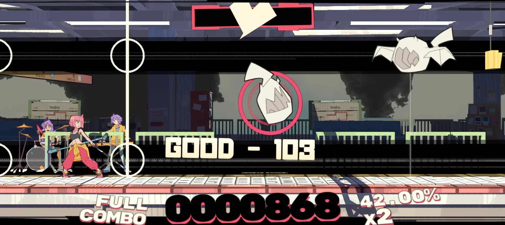

# Show Precise Accuracy Text

This mod for UNBEATABLE adds the precise timing text (the number next to the "PERFECT") for all hits.

## Compatible game versions

- UNBEATABLE Demo (tested with `v1.5.28-contentlock`)
- UNBEATABLE \[white label\] (tested with `v1.0.11-1`)

## Requirements

- [BepInEx](https://github.com/BepInEx/BepInEx)

## Installation

1. Download and install BepInEx into your game directory (if you use [CustomBeatmaps](https://github.com/gold-me/CustomBeatmapsV4), you have this installed already)
2. Run the game, then close it
3. [Download this mod](https://github.com/Zachava96/ShowPreciseAccuracyText/releases)
4. Merge the BepInEx folder from this mod with the BepInEx folder in your game directory
5. Run the game

## Configuration

There's only one option, which is to show values for spike dodges. You can change this in the `BepInEx/config/net.zachava.showpreciseaccuracytext.cfg` file by changing `ShowSpikeAccuracy = false` to `ShowSpikeAccuracy = true`

The comment in that file explains when the value will be shown.
